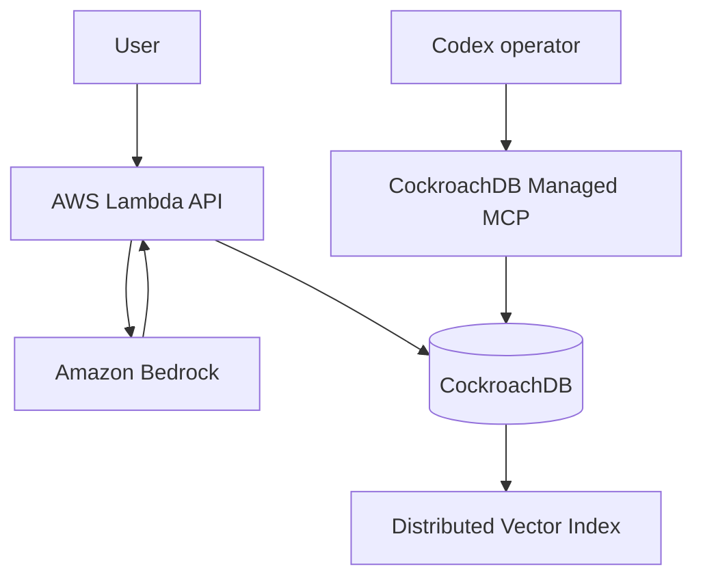

# Decision Memory Ledger

An agentic memory system that preserves **why** a human decision was made, not merely what happened.

The application records objectives, timestamped observations, interpretations, counterevidence, actions, regimes, and explicit invalidation conditions in CockroachDB. Amazon Bedrock embeds each decision. CockroachDB Distributed Vector Indexing retrieves semantically similar prior decisions, and a Bedrock-powered audit agent explains what changed before recommending whether to continue, modify, withdraw, or gather more evidence.

## Why this is agentic memory

Ordinary chat memory stores facts or summaries. Decision Memory Ledger stores a versioned causal record:

1. What objective was being pursued?
2. What was actually observed at the time?
3. What interpretation connected the evidence to the action?
4. What counterevidence was known?
5. What would invalidate the decision?
6. When a decision changed, exactly what changed?

The agent retrieves old decisions as evidence—not authority. Every audit is itself recorded, creating an inspectable history of memory use.

## Hackathon integrations

### CockroachDB

- **Persistent transactional memory:** versioned decisions and audit events are stored together.
- **Distributed Vector Indexing:** 1,024-dimensional Bedrock Titan embeddings power semantic retrieval through a CockroachDB vector index.
- **Cloud Managed MCP Server:** an operator agent can inspect schemas, memory rows, audit events, and database health without a custom proxy. See [MCP_RUNBOOK.md](docs/MCP_RUNBOOK.md).
- **CockroachDB Agent Skills:** CockroachDB's official Codex plugin is used to review schema, vector-index, security, and operational choices. Review evidence is recorded in [COCKROACH_SKILLS_REVIEW.md](docs/COCKROACH_SKILLS_REVIEW.md).

The competition requires at least two CockroachDB tools; the runtime project uses Distributed Vector Indexing and Managed MCP, while the official Agent Skills support engineering and review.

**Live verification (July 19, 2026):** the CockroachDB Cloud cluster contains the `decisions` and `audit_events` tables, the `decisions_embedding_idx` distributed vector index, and the lineage/version indexes. Codex authenticated to the Cloud Managed MCP server with OAuth and retrieved both live schemas in read-only mode.

### AWS

- **AWS Lambda** runs the FastAPI agent through Mangum.
- **Amazon Bedrock** generates Titan embeddings and produces the structured decision audit.
- **Lambda Function URL** provides the public functional demo endpoint.

## Architecture



## API

| Method | Route | Purpose |
|---|---|---|
| `GET` | `/health` | Show service and integration status |
| `POST` | `/schema/init` | Create tables and distributed vector index |
| `POST` | `/decisions` | Commit a new decision memory |
| `POST` | `/decisions?supersedes=<uuid>` | Add a version that explicitly supersedes an earlier decision |
| `POST` | `/audit` | Retrieve similar memories and audit a new case |

## Local setup

Prerequisites: Python 3.11+, a CockroachDB connection string, and AWS credentials with Bedrock access.

```bash
python -m venv .venv
source .venv/bin/activate
pip install -r requirements-dev.txt
cp .env.example .env
set -a; source .env; set +a
uvicorn src.app:app --reload
```

Initialize the schema once:

```bash
curl -X POST http://127.0.0.1:8000/schema/init
```

For UI work without Bedrock, set `ALLOW_LOCAL_EMBEDDINGS=true`. This deterministic fallback is for local development only; the deployed demo uses Bedrock.

## Deploy to AWS

Install the AWS SAM CLI, then run:

```bash
sam build
sam deploy --guided \
  --parameter-overrides DatabaseUrl="$DATABASE_URL"
```

SAM outputs the public demo URL. Invoke `/schema/init`, add sample memories, and verify `/audit` before recording the demonstration.

## Sample memory

```bash
curl -X POST "$DEMO_URL/decisions" \
  -H 'content-type: application/json' \
  -d '{
    "title":"Test a new publication channel",
    "objective":"Determine whether the channel creates durable reach or revenue",
    "observations":["300 ad clicks","zero sales","administrative friction increased"],
    "interpretation":"Traffic did not translate into meaningful value under the current offer",
    "counterevidence":["The sample may be too early for organic discovery"],
    "invalidation_conditions":["Qualified users convert under a small organic test"],
    "action":"Pause paid acquisition and withdraw from the channel",
    "regime":"failed acquisition experiment"
  }'
```

Then audit a related case:

```bash
curl -X POST "$DEMO_URL/audit" \
  -H 'content-type: application/json' \
  -d '{
    "question":"Should a second distribution channel continue?",
    "observations":["250 clicks","one signup","support workload doubled"]
  }'
```

## Origin and disclosure

This is a new application created during the CockroachDB × AWS Hackathon submission period. It builds on the previously published *Judgment Portability Layer* concept and its inspectable decision-audit method. The previous work is disclosed as conceptual and method-layer prior work; this repository's database schema, vector-memory system, AWS application, UI, APIs, audit ledger, and deployment materials are new.

## Safety

This tool supports decisions; it does not acquire medical, legal, fiduciary, employment, or regulatory authority. Retrieved memories can be wrong or obsolete. The agent must expose counterevidence and invalidation conditions, and consequential decisions remain with the human or qualified professional.

## License

MIT © 2026 Ryuta Sugimoto
